# Asset Tracking with Blockchain and IoT

In this pattern, we will be creating a local Hyperledger Fabric network using the IBM Blockchain Platform extension for VSCode which makes it easy to start developing smart contracts. 

The solution that we will be creating is an asset lifecycle and tracking solution that keeps a record of the asset from creation to deletion. Also, we will be creating and managing asset leases which keep track of the lease terms in a lease agreement such as end date, price, and deposit amount. 

For the IoT integration, we will be leveraging the IBM Watson IoT Platform to handle device scanning at various locations as the asset is being transferred. Instead of having an actual physical device, we will be creating a web app pretending to be a device which will trigger these scans and notify a locally node.js app to invoke the updateAssetLocation transaction.

After completing this pattern you will understand how to:
- Deploy smart contracts to a local Hyperledger Fabric network
- Create a simulated IoT device using the IBM Watson IoT Platform and Node-Red
- Connect to a Hyperledger Fabric application using the Fabric SDK for Node.js
- Publish IoT events to the ledger on a device event such as a scan

# Flow
1. The smart contract is deployed to a local Hyperledger Fabric network via the IBM Blockchain Platform extension for VS Code.
2. As the asset is moved from place to place it is scanned via RFID or barcode by an IoT device. In this pattern, the device is simulated.
3. The IoT device publishes an event notification to the IBM Watson IoT Platform, which then notifies all listening applications that a scan has taken place.
4. An application listening to the IBM Watson IoT Platform for scanning events then invokes a transfer transaction.
5. The location of the asset is updated in the ledger automatically.


## Scenario
In this demo scenario we have three participants: a manufacturer, a vendor, and a contractor. 
1. The manufacturer creates the asset and sells it to the vendor. 
2. The vendor then creates a lease with the contractor which defines terms including how much deposit is to be paid and how much deposit will be returned based on the amount of damage that the asset has received during the lease duration. For example, if the asset is returned with 21% damage then only 60% of the deposit will be returned. 
3. After the lease duration is over, the asset is returned to the vendor and inspected for damage. The lease is then updated to reflect the amount of damage that the asset received.
4. The asset is sent back to the manufacturer for repairs. If the vendor has a warranty to cover future repairs with the manufacturer, the manufacturer could take a look at the history of the asset and see if any activity such as imporper usage has voided the warranty.
5. The asset is then returned to the vendor to be leased out again.


## Structure of Asset

The asset being stored in the ledger has the following properties:

- manufacturer - creator of the asset
- assetNumber - serial number given to the asset
- assetType - type of asset
- currentOwner - Who currently posesses the asset
- currentState - The current state of the asset
- percentDamage - The amount of damage in percent found during the inspection stage
- location - Where the asset was scanned last

## Structure of the Asset Lease

The asset lease being stored in the ledger has the following properties:

- leaseNumber - Lease agreement number
- lessee - Who is receiving the lease
- lessor - Who is leasing the asset out
- assetKey - The key of the asset being leased
- dateLeased - The date the lease goes into effect
- endOfLease - The end of the lease agreement
- price - The total price of the lease payments
- depositPaid - The deposit paid up front
- dateReturned - The date the asset was returned
- percentDamaged - The condition of the asset on return displayed in percent damaged
- depositReturned - Based on the ammount of damage, the amount of the deposit returned

# Prerequisites
- an IBM Cloud account
- VSCode
- The IBM Blockchain Platform extension for VSCode 

# Creating the Node-Red simulated device application
To start off, we are going to create the simulated IoT device which will invoke the updateAssetLocation with the location where the device was "scanned". We will be using the IBM Watson IoT Platform to facilitate the communicaton from our virtual device to a local IoT service which will be listening for published device events. 

For the code used to build this virtual device, we will be using a framework called Node-Red which is a low code environment which allows for drag and drop of preconfigured nodes to easily build applications. 

IBM Cloud has a starter kit for IoT applications that comes with a Node-Red application and an instance of the IBM Watson IoT Platform service already bound to it. 

1. Go to [IBM Cloud](https://cloud.ibm.com) and log in if you haven't already
2. Click on **Catalog** at the top right of the page
3. From the catalog, select **Starter Kits** from the category list on the left side to narrow the services shown.
4. Then, find and click on the **Internet of Things Platform Starter** kit.

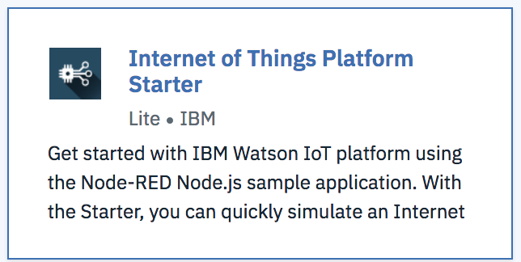

5. On the next page, give the new application a name. It's important that the name be unique so that there are no hostname conflicts with other applications out there. To make it easy, you can add your initials before the hostname (e.g. My name is Oliver Rodriguez so I might name my application or-asset-tracking).

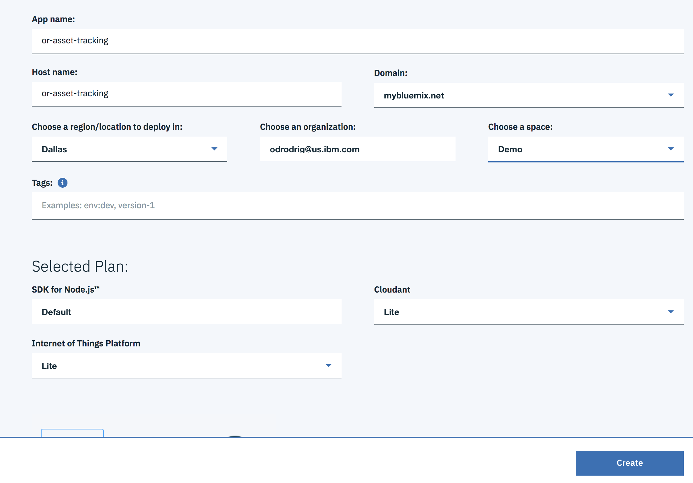

6. Click create. This creation process will take a bit.

7. Once the application is deployed, click on **Visit App URL** at the top of the page to go to the application.

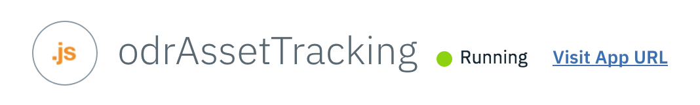

8. The first time you open a Node-Red application you have to go through the initial set up wizard. To start, create an admin username and password. You can also select the checkbox to give read access to anybody that visit's your app.

9. When done with the wizard you should be taken to the application. Click on the red button that says **Go to your Node-RED flow editor**. The page that you are brought to is called the **Canvas** which is where you drag and drop your nodes. The left pane that holds all the nodes is called the **palette**.

10. To make any changes you will need to log in with the admin account created during set up. Click on the sillouette at the top right of the page and click **log in**. Then, enter your username and password to log in.

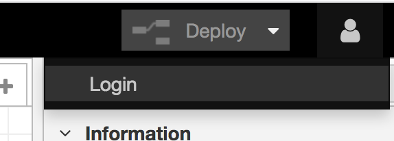

 You may notice that this application already comes with some starter code, go ahead and select it all with your curser by clicking and draging and then press your delete key.

10. We will be importing some of our own code for the virtual device. To do this, click on the menu button at the top right, select **Import** and **Clipboard**. 

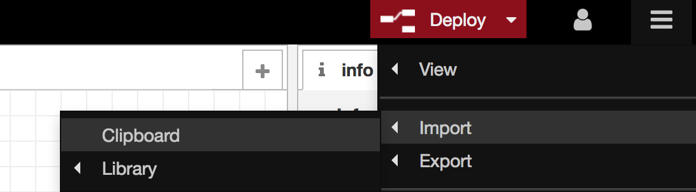

Then paste in the contents of the [**flow.json**](./flow.json) file from this repo and click **Import**.

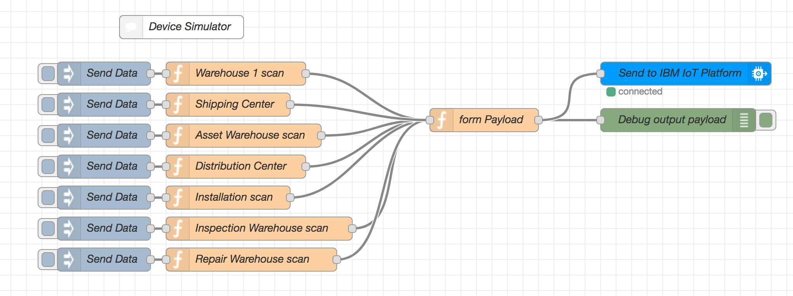

Now that we have our flow imported, we now need to use the IBM Watson IoT Platform to facilitate communication between the virtual device and the local IoT application.


# Connect with the IBM Watson IoT Platform

1. From the dashboard of IBM Cloud, click on the IBM Watson IoT Platform service. You may need to expand the *Cloud Foundry services* section.
2. On the overview page for the service, click on **Launch**

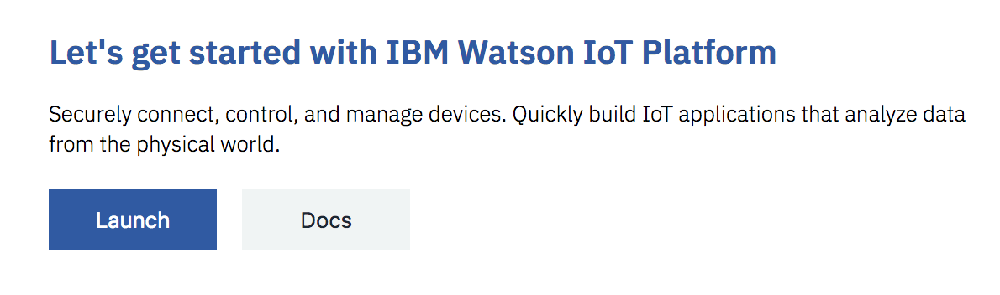

3. Once in the IoT Platform, click on the **Devices** button from the left navigation panel.

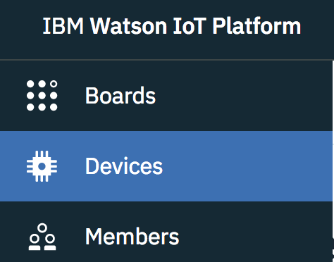

## Create a new Device Type

4. Once in the devices page, click on **Add Device** at the top right of the page.
5. Click on the **Device Type** tab at the top left of the page.
6. Once on the new page, click on **Add Device Type** at the top right.
7. Then, ensure **Type** is **Device** and enter **asset** as the **Name**

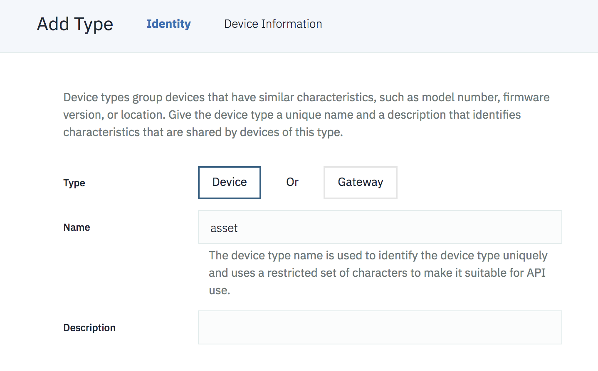

8. Click **Next** and click **Done** on the next page.


## Register a new device

9. On the new page, click on **Register Devices**

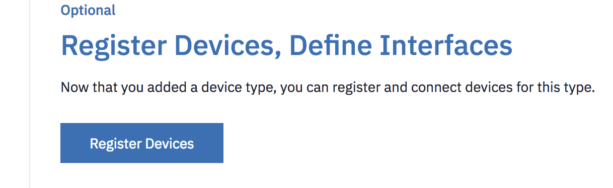

10. Next, ensure that **asset** is selected as the **Device Type** and enter **A-001** as the **DeviceID**
11. Click **Next**, and then **Next** again on the device defaults page, and then **Next** again on the token generation page.
12. Click **Done** to complete device registration
13. Once you complete registration, you will be taken to the **Device credentials** page. Copy everything in the **Device credentials** object and save it in a seperate doc.

 It's important to copy the Authentication Token as you will not be able to retrieve it once you leave the page. 

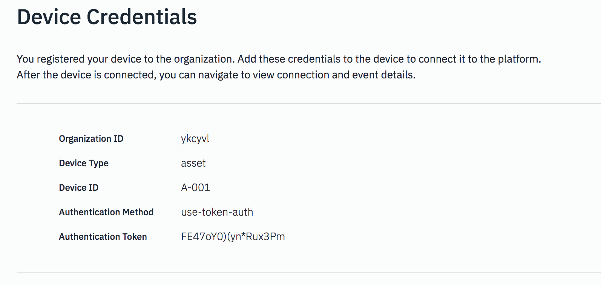


## Register an App
Now we need to register an application with the platform to generate an API key

1. Click on the **Apps** button on the left navigation panel

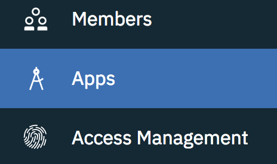

2. On the Apps, page, click on **Generate API Key** at the top right of the page.

3. Add a description if you wish, then click on **Next**

4. On the new page, select **Standard Application** as the **Role**

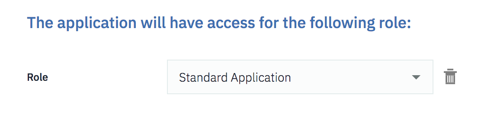

5. Click **Generate Key**

6. Once the API Key has been added, copy both the **API Key** and the **Authentication Token** to a seperate doc.

Again, just like with the device credentials, you cannot retrieve the token once you leave the page. Be sure to have it copied somewhere.

7. Next, take a look at the address bar of your IBM Watson IoT platform page and copy the part of the address that comes before *.internetofthings.ibmcloud.com*. It should be 6 characters. These character represent your IoT org. Copy them into a text document for later.


Now that we have our device registered and the credentials saved, let's return to our code editor.

# Starting the local Hyperledger Fabric network
Before we go any further, we need to start our local blockchain network. Luckily for us, there is a plug in for VSCode called the IBM Blockchain Platform extension that allows us to get a network up and running with the push of a button. 

1. Open up Visual Studio Code
2. If you don't already have it, install the IBM Blockchain Platform extension in VSCode using the instructions found [here](https://github.com/IBM-Blockchain/blockchain-vscode-extension)

2. Once the extension is installed, click on the IBM Blockchain Platform icon on the left toolbar of VSCode.


3. Hover your mouse over the section labeled **Local Fabric Ops** and click on the three button menu that appers and select **Start Fabric Runtime**

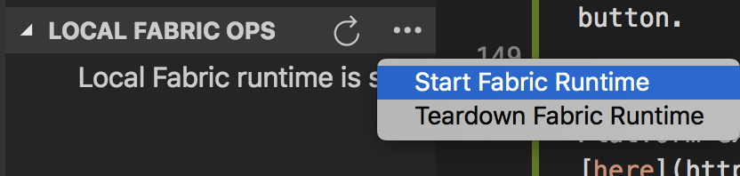

Your local network will then be spun up in docker containers on your machine. We will be using this local networks to deploy our smart contracts to. 


# Creating the Logspout Container
Throughout this workshop we may need to see what the output of certain actions against the Hyperledger Fabric network are. To see this output we will be implementing a special container called the logspout container. This container will monitor all log output from all containers in a certain docker network. In this case, we can see what each container in our Hyperledger Fabric network is saying which will help with debuging.

1. Navigate to this repo in your terminal/command prompt
2. Find and run **org1/configuration/cli/monitordocker.sh**
3. Keep this terminal window open

# Packaging chaincode
In order to start using the chaincode we need to package, install, and instantiate it first. 

1. To package the chaincode, first go to the file explorer in Visual Studio Code.
2. Then, right click in the empty space below the project files and select **Add Folder to Workspace**

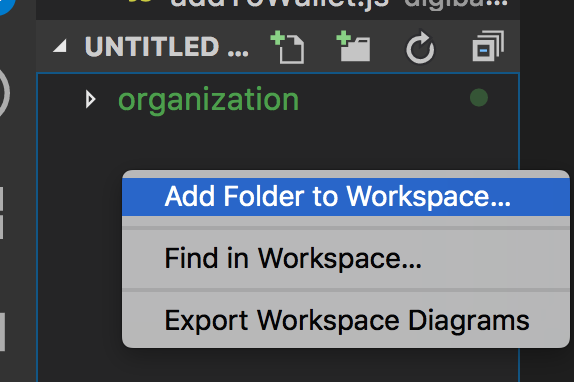

3. In the new dialog window, find the **org1/contract** folder in this repo and click **Add**. You should now see **contract** appear in the file explorer.
4. Then, click on the IBM Blockchain Platform extension on the left side of VSCode.
5. Find the **Smart Contract Packages** section, hover your mouse over it, and click on the three dot menu. Then select **package a smart contract project**

6. A new prompt should appear at the top of VSCode asking to choose a workspace folder to package. Select **contract**

You now have a smart contract package named **asset-tracking** with a version number following it. Everytime you make a change to the smart contract, you must increase the version number in **package.json** and repackage the smart contract.

Now that we have the smart contract packaged we need to install the smart contract onto a peer.

# Installing and Instantiating
Getting the smart contract on to a Hyperledger Fabric network involves two key steps: Install and Instantiate.

Install is simply the process of putting the smart contract onto a peer. Although the peer holds the smart contract, the contract does not execute on the peer. This is where the instantiation process comes in.

Instantiation is performed on a channel by a peer and it is the process of creating a chaincode container to execute logic found in smart contracts. Having the chaincode execute in a separate container ensures security and stability as chaincode execution does not have access to the peer file system and cannot bring the peer down in the event of a crash.

### Installing Chaincode:

1. In the IBM Blockchain Platform extension find the **Local Fabric Ops** section and click on **+ Install**

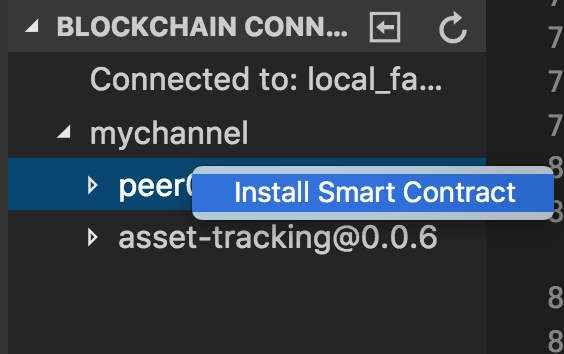

2. In the prompts that come up select *peer0.org1.example.com*

3. Then select the smart contract that we just packaged which should be *asset-tracking@1.0.0*

Your smart contract is now installed. Next we need to instantiate it.

### Instantiate Chaincode

1. Find the **Instantiated** section under **Local Fabric Ops** and click on **+ Instantiate**

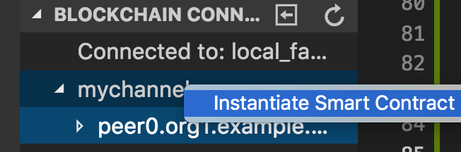

2. In the prompt that comes up, select *mychannel*

3. A prompt should appear at the top of VSCode asking which smart contract to instantiate. Select the one that was just installed.
4. The next prompt should ask for a function to call. Enter **instantiate** and press enter.
5. Then, a new prompt will ask for arguments to pass. We don't have any to pass in so just press enter.
5. While the smart contract is instantiating you can see how the process is going by checking on the logspout container which should be running in a terminal window.

If there are any errors during instantiation, you can see what went wrong in the logspout container. 

Now we are ready to test out transactions.

# Invoking transactions with the IBM Blockchain Platform VSCode Extension
Another handy function of the IBM Blockchain Platform VSCode extenstion is the ability to invoke transactions without having to write an application to do so.

1. In the **Fabric Gateways** pane of the IBM Blockchain Platform extension, click on **local_fabric**.

This will allow us to intract with our local network through the eyes of the organization admin user. 

2. Click on **Channels** and then **mychannel** to display the smart contracts that are instantiated on our channel, mychannel. There should only be one, **asset-tracking**. Click on it.

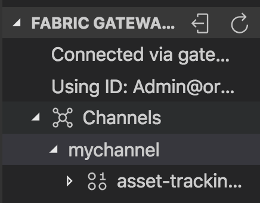

3. You should now see a long list of transactions that are defined in the smart contract.

You can right click on a transaction and select **submit transaction** to invoke the transaction in the contract. Once you select **submit transaction** you will be asked for arguments to pass in. You may need to check out the AssetContract.js file to see what transactions require which arguments.

Let's test out some transactions. Submit the following transactions with the respective arguments:

At the moment, our ledger doesn't have any information, let's populate it with some dummy data.

1. Right click on **setUpDemo** and select **submit transaction**

2. When asked for agruments, press enter.

3. Next let's query the ledger and see what was added. Right click on the **queryAll** transaction and select **evaluate transaction**. When asked for arguments, press enter.

Check out the terminal window that was tailing the logs in the logspout container to see the results of the query.

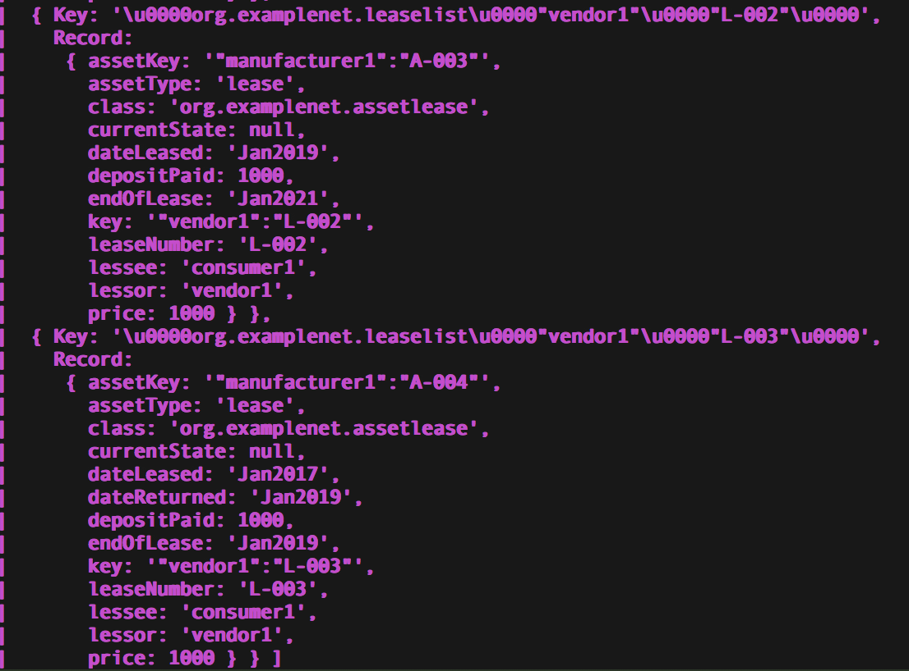

# Adding Identities to the Wallet
Invoking transactions with the VSCode extension is easy enough but when you want to start building applications there are a few extra steps. Now that we are building applications we need to start worrying about identities. For this lab, we have one identity that we need to create.

1. In your terminal navigate to the **application** folder and find the **addToWallet.js** program.
2. Run the program with the following commands

```bash
npm install
```

```bash
node addToWallet.js
```

This program will add the identity to our wallet that we will use to invoke transactions using the Node SDK.

# Invoking transactions with the Node SDK
In this section we will be invoking the transactions defined in assetContract using the the **fabric-network** module. This is a new module introduced in Hyperledger Fabric 1.4.

In the **application** folder you will find **invoke.js**. In this file we will be copying and pasting the code to invoke transactions and see what the response is.

1. In your code editor, navigate to this repo and open **org1/application/invoke.js**
2. Look for the **Transaction Invocation** block comment section.

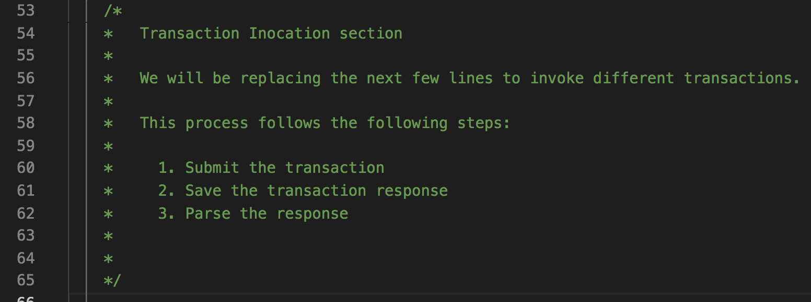

3. In between the end of that comment block and the **End of transaction invocation section**, paste in the code for each transaction mentioned below.

4. Save the file
5. Run **invoke.js** with the following command

```
node invoke.js
```

We will be following the same transaction order from the previous section on invoking transactions with the VSCode extension.

Using the 5 steps outlined above, invoke a few of the following transactions if you would like to see the SDK in action.

1. Manufacture Asset
2. Transfer Asset
3. Create Lease
4. Transfer Asset again
5. Return Asset
6. Inspet Asset
7. Repair Asset
8. Return Deposit


## Manufacture Asset
The manufactureAsset transaction creates a new digital asset to be stored on the ledger. Once the transaction is successful, the new asset is returned.


```javascript

    const manufactureResponse = await contract.submitTransaction('manufactureAsset', 'manufacturer1','A-005', 'asset');
    let asset = Asset.fromBuffer(manufactureResponse);

    console.log(asset);
    
```

## Transfer Asset
The transferAsset transaction transfers ownership of the asset within the ledger. Returns the transferred asset

```javascript

   const transferResponse = await contract.submitTransaction('transferAsset', "manufacturer1","A-005","manufacturer1","vendor1");
   let asset = Asset.fromBuffer(transferResponse);

   console.log(asset);
    
```

## Create Lease
The createLease transaction creates a lease which defines the lessee, lessor, and other lease terms. Returns the created lease.

```javascript

   const createLeaseResponse = await contract.submitTransaction('createLease', "L-004","contractor1","vendor1","A-005","manufacturer1","lease","Jan2019","Jan2021","1000.00","1000.00");
   let assetLease = AssetLease.fromBuffer(createLeaseResponse);

   console.log(assetLease);
    
```

## Transfer Asset again
The transferAsset transaction transfers ownership of the asset within the ledger. Returns the transferred asset

```javascript

   const transferResponse = await contract.submitTransaction('transferAsset', "manufacturer1","A-005","vendor1","contractor1");
   let asset = Asset.fromBuffer(transferResponse);

   console.log(asset);
```

## Return Asset
The returnAsset transaction is invoked when a lessee wants to return the leased asset at the end of the lease. Returns the returned asset and the lease that has ended.

```javascript

   const returnResponse = await contract.submitTransaction('returnAsset', "manufacturer1","A-005","contractor1","vendor1","L-004","Jan2021");
   
   let response = JSON.parse(returnResponse.toString());

   let asset = response.asset;
   let assetLease = response.assetLease;

   console.log(asset);
   console.log("");
   console.log(assetLease);
    
```

## Inspect Asset
The inspectAsset transaction is invoked when the asset has been received and inspected by the vendor. This transaction records the percent of damage to the asset on the lease. Returns the inspected asset and lease.

```javascript

   const inspecteResponse = await contract.submitTransaction('inspectAsset', "manufacturer1","A-005","vendor1","L-004","21");

   let response = JSON.parse(inspecteResponse.toString());

   let asset = response.asset;
   let assetLease = response.assetLease;

   console.log(asset);
   console.log("");
   console.log(assetLease);
    
```

## Repair Asset
The repairAsset transaction is called after the asset has been repaired. Sets the asset condition to **Refurbished** and the state to **Available**. Returns the repaired asset.

```javascript

   const repairResponse = await contract.submitTransaction('repairAsset', 'manufacturer1','A-005');
   let asset = Asset.fromBuffer(repairResponse);

   console.log(asset);
    
```

## Return Deposit
The returnDepost transaction records the amount of the depost to be returned to the lessee. This is calculated by looking at the percent of the asset damaged which was recorded in the lease by the inspectAsset transaction and then multiplying the original deposit paid by a percent which corolates with the amount of damage. (e.g. >20% damage to the asset = 80% of the original deposit returned). Returns the lease.

```javascript

   const returnDepositResponse = await contract.submitTransaction('returnDeposit', 'vendor1','L-004');
   let assetLease = AssetLease.fromBuffer(returnDepositResponse);

   console.log(assetLease);
    
```

# Configuring the local IoT Service 
Remember that IoT set up that we did earlier? Now let's put it to use. In this section we will be starting a local application that listens for IoT events and updates the ledger. In our case these events will be "scans" from our simulated device.

1. In VSCode navigate to this repo and open **application/iot_service/app.js**
2. Look for the **appClientConfig** object around line 8 and enter the application API **Auth key**, **Auth Token**, and **org id** that you saved earlier from the IoT Platform. 
3. For *id* enter a name for your application that has no spaces such as "**tracking**".

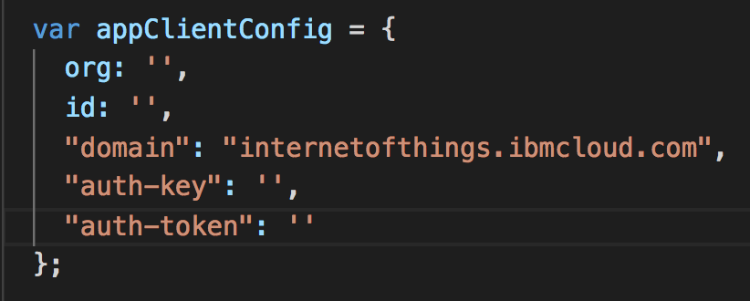

3. Next, run the following commands to start the IoT app.

```
npm install

node app.js
```

4. The app is now running in the terminal window and will output any data received from the IoT Platform.

Now that the app is running, let's test it out.

# Scan Device
In this section we will trigger some device events from our simulated device which in turn will invoke the updateAssetLocation transaction and update the asset's location in the ledger.

1. Open your browser to the Node-Red app that we deployed before. If you closed the tab, go back to the IBM Cloud dashboard and luck under **Cloud foundry applications**

2. You should see a bunch of blue nodes with buttons to the left side of them. These nodes are called *inject* nodes and are used to start flows or inject inforamtion into the payload. In our app, we use them to start the flow to emit a device event to the IoT Platform. 

3. All you need to do is click on the blue button next to the corresponding location that you want to simulate a scan even at.

For example, if you want to simulate the device arriving at the vendor's inspection warehouse at the end of a lease, just click on the inject node next to the orange **Inspection Warehouse scan** node.

4. Check out the output in the terminal where the IoT app is running and you should see both the device event being received and the successful transaction response with the updated asset location.

# Query the World State
To query the world state database there are two files that we can use to help us out: queryByField.js and queryAll.js.

**queryByField.js** does just what it says. It queries the world state and only returns assets that match the values for a field such as "currentOwner", "assetType", or "currentOwner". For example, we can use this file to get all assets that are owned by vendor1.

**queryAll** also does what it says. It returns everything in the world state.

1. In a terminal window navigate to the **application** folder
1. Run queryByField.js with this command

```
node queryByField.js
```

By default, it will return all assets with **assetType** that equals **"asset"** which means it will not return leases.

2. Now run queryAll.js with this command

```
node queryAll.js
```

This will return everything in the ledger.


# Recap
In this lab we did a lot. First we created a virtual device with Node-Red and then configured the IBM Watson IoT Platform and received API credentials. Next we created the logspout container to monitor logs from our Hyperledger Fabric network. After that, we packaged, installed, and instantiated a smart contract on our local Hyperledger Fabric network. This allowed us to test out some of our transactions using the VSCode plugin. Once we were done testing out the transactions we decided to import some identities and start invoking transactions with the Node SDK. Then, we started the local IoT app to start listening for scan events which we then began to send from our Node-Red app. Finally, we queried the world state database using two different query programs.

<!-- keep this -->
## License

This code pattern is licensed under the Apache License, Version 2. Separate third-party code objects invoked within this code pattern are licensed by their respective providers pursuant to their own separate licenses. Contributions are subject to the [Developer Certificate of Origin, Version 1.1](https://developercertificate.org/) and the [Apache License, Version 2](https://www.apache.org/licenses/LICENSE-2.0.txt).

[Apache License FAQ](https://www.apache.org/foundation/license-faq.html#WhatDoesItMEAN)
